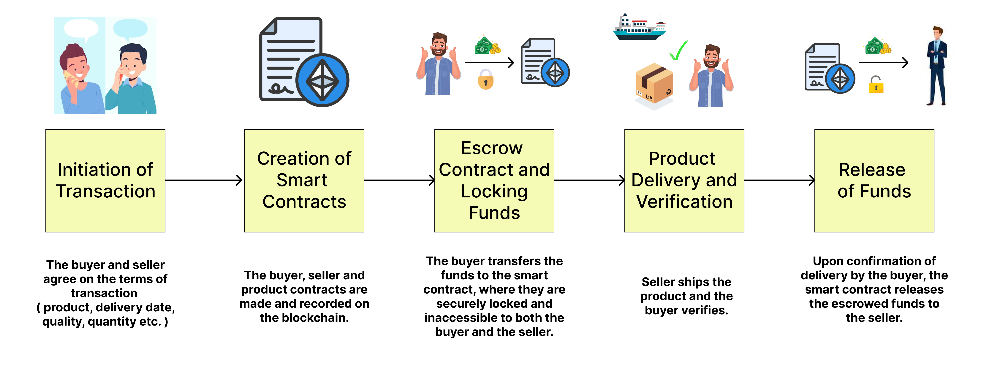
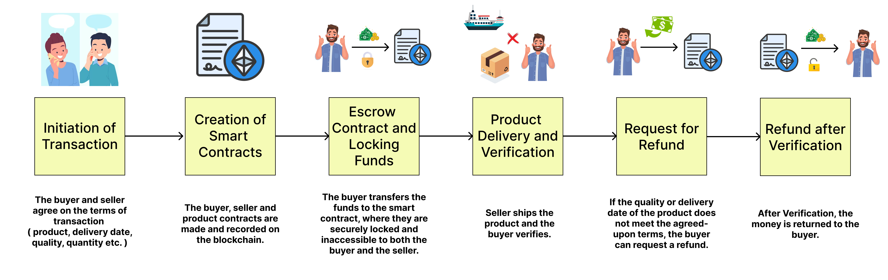
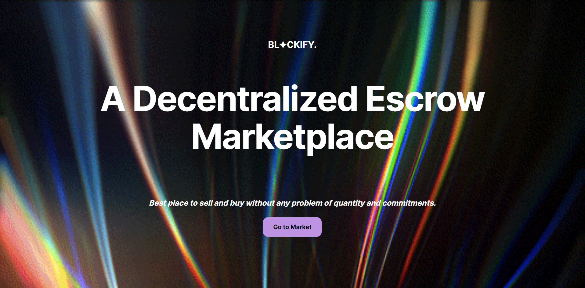
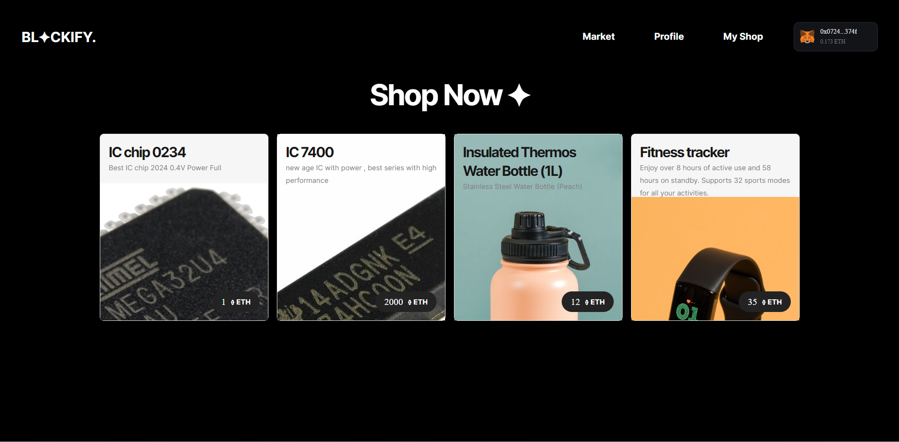
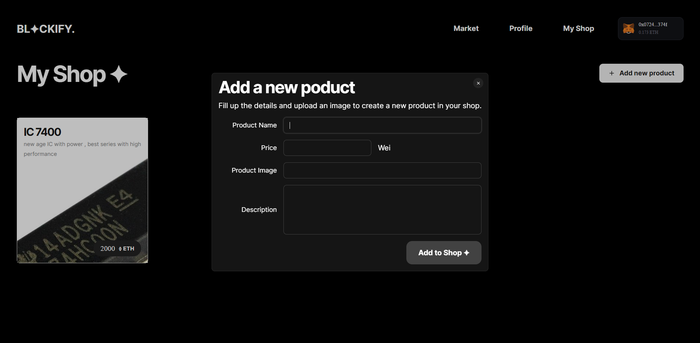
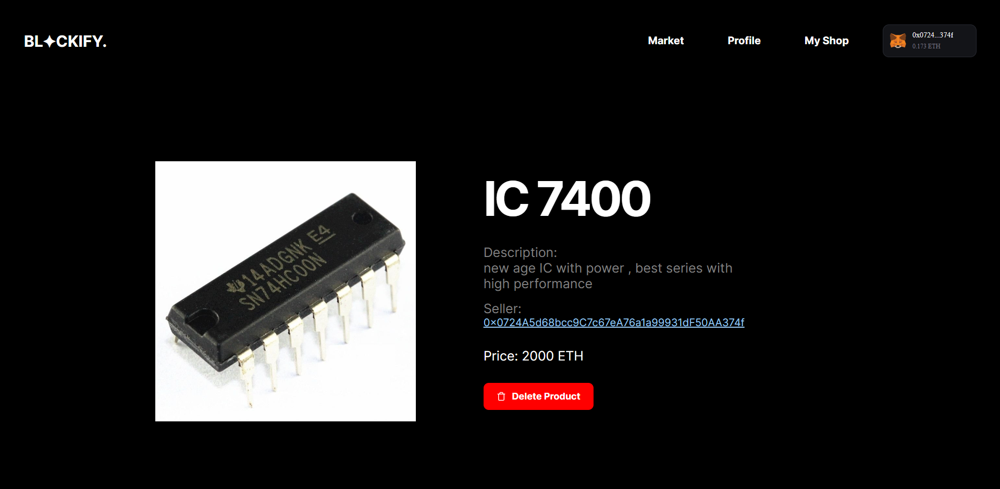

# Blockify : Escrow Marketplace Dapp

## 🔦 About

In online transactions, buyers often face uncertainties regarding the delivery of products purchased from sellers. Common issues include:

- **Lack of Assurance**: Buyers have no guarantee that the product will be delivered as promised, particularly when payment is made upfront.

- **Risk of Fraudulent Claims**: Buyers may falsely assert that they did not receive the product, leading to disputes and financial losses for sellers.

These challenges highlight the need for a more secure and trustworthy system to facilitate online transactions. Traditional methods rely on trust between the buyer and seller, which can be easily exploited. 

Blockify is a blockchain based escrow marketplace where the funds are stored in the blockchain untill the buyer receives the product with specified quality.

Normal Case : 

Defective Product Case : 

## 📦 Tech Stack

- [Thirdweb SDK](https://portal.thirdweb.com/typescript/v5) 
- [Tamagui](https://tamagui.dev) starter
- [solito](https://solito.dev)
- Hardhat
- Next.js

## 🏁 Start the app

- Clone the repo : `git clone https://github.com/adityakhare86/decentralized_marketplace.git`

- Change directory : `cd decentralized_marketplace`

- Install dependencies: `yarn`

- Set your Thirdweb Client ID in `packages/app/client.ts` 

- Set your Contract Address and ABI in `packages/app/contract.ts`

- Run Next.js project : `yarn web`

- App running on : `http://localhost:3000`

## 🔎 Demo 

